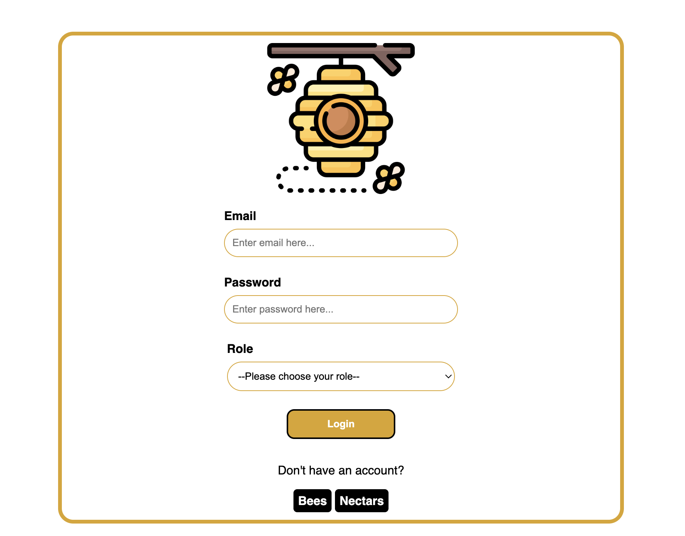
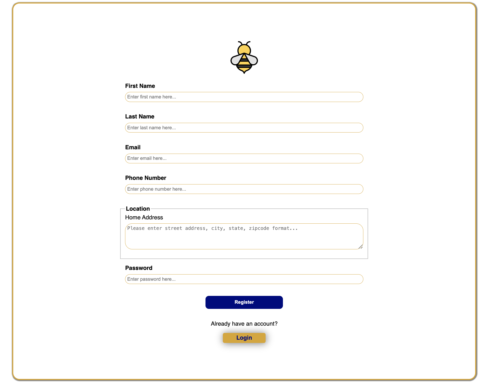
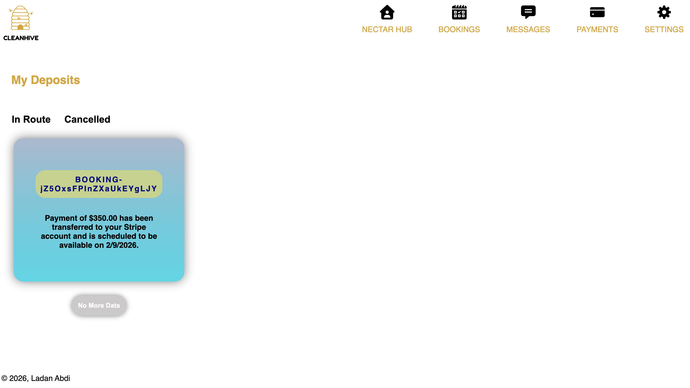
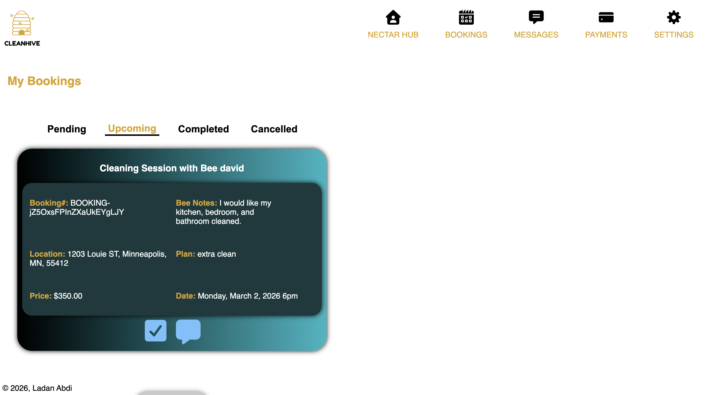

# CleanHive

<h2>Description</h2>

 A production-ready full-stack home cleaning services platform that enables customers
to book professional cleaners, chat in real time, and securely complete online payments.
Designed for scalability, accessibility, and performance, the application supports
individuals with limited mobility, busy professionals, and businesses by making
on-demand cleaning reliable and easy to manage. 

<h2>Product Overview</h2>

Many individuals and businesses struggle to find reliable cleaning services due to
time constraints, physical limitations, or lack of transparent booking systems.
This project was built to solve that problem by providing a secure, accessible,
and scalable platform that connects customers with trusted cleaning professionals.

<h2> App Terminology </h2>
<ul>
  <li>Customers(Bees)</li>
  <li>Cleaning Agents(Nectars)</li>
</ul>

<h2>Live Demo</h2>

Check out the deployed app: <a href="https://clean-hive.onrender.com/" target="_blank">CleanHive</a>

<h2> App Preview </h2>

<h3>Home Page</h3>

<h3>Login Page</h3>

<h3>Bee Registration Page</h3>

<h3>Nectar Registration Page</h3>

<h3>Bee Profile Page</h3>

<h3>Nectar Profile Page</h3>

<h3>Nectar Profile Page Responsive</h3>

<h3>Bees' Review Page</h3>

<h3>Bee Checkout Page</h3>

<h3>Nectar Payments Page</h3>

<h3>Nectar Bookings Page</h3>

<h3>Messaging Page for Bees and Nectars</h3>

<h3>Bee Settings Page</h3>

<h2>Features</h2>
<h3>Bee & Nectar Accounts</h3>
<ul>
  <li>Register as a Bee or Nectar</li>
  <li>Secure login and authentication using JWT and bcrypt</li>
  <li>Personalized profile pages for Bees and Nectars</li>
  <li>Nectars are able to update profile information (phone number, bio, cleaning plan, and availability)</li>
  <li>Nectars are required to update availability times weekly</li>
  <li>Bees are able to update profile information (phone number and address)</li>
</ul>

<h3>Browse Nectars</h3>
<ul>
  <li>View a list of available Nectars</li>
  <li>Select a Nectar directly from their profile</li>
  <li>Search for a Nectar by name</li>
</ul>

<h3>Book a Cleaning Service</h3>
<ul>
  <li>Book cleaning services through a guided checkout process</li>
  <li>Select service type, date and time, and cleaning service notes</li>
  <li>Booking confirmation only after successful Stripe payment</li>
  <li>Bookings are stored and managed in MongoDB</li>
</ul>

<h3>Bee Payment Flow</h3>
<ul>
  <li>Payments are collected using Stripe Elements: CardNumberElement, CardExpiryElement, and CardCvcElement</li>
  <li>Card details are tokenized by Stripe and don't touch the application server</li>
  <li>A PaymentIntent is created server-side and confirmed client-side</li>
  <li>Payment status is stored and associated with the booking in MongoDB</li>
</ul>

<h3>Nectar Payout Flow (Stripe Express)</h3>
<ul>
  <li>Nectars onboard via Stripe Express accounts</li>
  <li>Onboarding is handled using Stripe Account Links</li>
  <li>Nectars securely provide: Bank routing, account numbers, and identity verification details</li>
  <li>The platform does not store sensitive financial data</li>
</ul>

<h3>Booking Cancellations</h3>
<ul>
  <li>Cancellations can be initiated by: Bees and Nectars</li>
  <li>A 24-hour cancellation window is enforced: Bookings cannot be cancelled within 24 hours of the scheduled service time using time-based validation</li>
  <li>A Stripe refund is issued directly to the Bee if the funds have not yet been paid out to the Nectar</li>
  <li>A Stripe transfer reversal is performed if the funds have been paid out to the Nectar</li>
</ul>

<h3>Booking Statuses</h3>
<ul>
  <li>Pending – Booking created, awaiting confirmation from Nectar</li>
  <li>Upcoming – Payment confirmed and service scheduled</li>
  <li>Completed – Cleaning service successfully fulfilled</li>
  <li>Cancelled – Booking cancelled by Bee or Nectar</li>
</ul>

<h3>Bee Payment View</h3>
<ul>
  <li>Total amount paid</li>
  <li>Booking reference number</li>
  <li>Payment status (in route, or cancelled)</li>
  <li>Card details (masked): Card brand, Last 4 digits, Expiration date</li>
  <li>Note: Sensitive card data such as full card numbers and CVC codes are never stored or exposed. All card information is securely handled and tokenized by Stripe</li>
</ul>

<h3>Nectar Payment View</h3>
<ul>
  <li>Booking reference number</li>
  <li>Bee name</li>
  <li>Payout status (in route, or cancelled)</li>
  <li>Funds availability date (when payout becomes available)</li>
  <li>Transfer or reversal status (if applicable)</li>
</ul>

<h3>Real-Time Messaging</h3>
<ul>
  <li>In-app messaging between Bees and Nectars</li>
  <li>Built using Firebase Realtime Database / Firestore</li>
  <li>Messages are tied to individual bookings</li>
  <li>Enables real-time communication without page refresh</li>
</ul>

<h3>Reviews & Ratings</h3>
<ul>
  <li>Bees can leave reviews and delete reviews after completed services</li>
  <li>Top 4 reviews are displayed on Nectar profiles</li>
  <li>Full reviews visible to Bees: All Bee reviews are fully visible to other Bees to enhance authenticity and trust </li>
</ul>

<h3>User Feedback & Notifications</h3>
<ul>
  <li>React Hot Toast used for: </li>
  <li>Booking confirmations</li>
  <li>Successful payments</li>
  <li>Profile updates</li>
  <li>Error handling and policy violations (e.g. late cancellations)</li>
  <li>Provides real-time, non-intrusive user feedback</li>
</ul>

<h3>File Storage (AWS)</h3>
<ul>
  <li>Nectar uploaded images such as profile photos are stored in AWS S3 </li>
  <li>CloudFront CDN serves assets with low latency and caching</li>
  <li>Improves load times and scalability</li>
</ul>

<h3>Responsive UI</h3>

<h2>Tech Stack</h2>
<ul>
  <ul>
    <h4>Frontend:</h4>
    <li>Next.js: Data fetching from custom APIs using useEffect, state management with useState, and dynamic page routing with useRouter and useParams.</li>
    <li>React</li>
    <li>CSS</li>
  </ul>
   <ul>
    <h4>Backend:</h4>
    <li>Node.js / API Routes (Next.js)</li>
    <li>MongoDB</li>
     <li>Firestore Database</li>
    <li>Sharp: Image processing to resize Nectar profile images</li>
  </ul>
  <ul>
    <h4>Authentication:</h4>
    <li>JWT (JSON Web Tokens)</li>
    <li>bcrypt for password hashing</li>
  </ul>
  <ul>
    <h4>Environment Variables:</h4>
    <li>dotenv</li>
  </ul>
  <ul>
    <h4>Testing</h4>
    <li>React Testing Library: Frontend testing of components, interactions, and user flows</li>
    <li>Jest: Backend unit and integration testing</li>
    <li>next-api-handler</li>
  </ul>
    <ul>
    <h4>Integrations</h4>
    <li>Stripe API: Secure payment processing</li>
    <li>Firebase API: Real-time chat and messaging</li>
    <li>AWS S3: Image and file storage</li>
    <li>AWS CloudFront: CDN for fast global asset delivery</li>
  </ul>
</ul>

<h2>How To Get Started</h2>
<ol>
  <li>git clone https://github.com/la-abdi25/Clean-Hive.git</li>
  <li>cd home_cleaning_services_app</li>
  <li>npm install</li>
  <li>npm run dev</li>
  <li>Visit http://localhost:3000</li>
</ol>

<h2>License</h2>

This project is licensed under the <a href="LICENSE">MIT License</a>.

  
